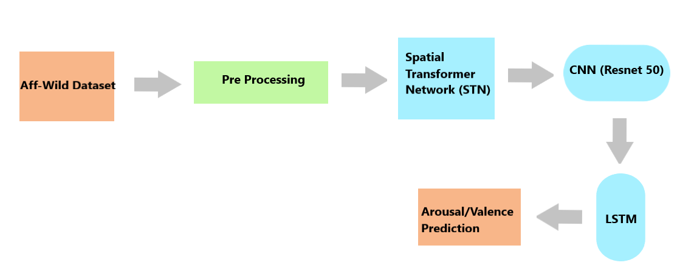
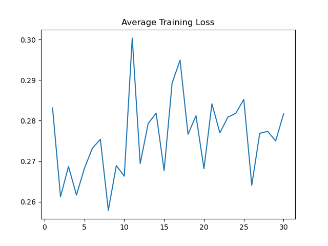

# EmotionRecognitionOnVideo

## Introduction
This project aims to predict the type of Emotion of Videos. The prediction is based on arousal-valence chart as shown below. Arousal (intensity) is the level of activation ranging from calm(low) to exicited(high). Valence is the level of pleasantness from negative to positive. 

The task at hand is to input a video. For a bunch of frames(say 32) output two values- arousal and valence ranging between -1 and 1. Hence this is a regression task.
(Apologies for dumping all the modules in a single code. Will try later to organize it in a better way)

## Dataset
The dataset used is [Aff-Wild2 database](https://ibug.doc.ic.ac.uk/resources/aff-wild2/) which contains 558 videos with 2.8 million frames. The data provided with the videos include the following for each frame- bounding boxes of faces, arousal value, valence value. 

## Network Architecture
The pipeline followed in this is shown below. A batch of 32(or 16) images are chosen to be pre-processed and sent to a STN (hard attention). The output is provided to a 2D CNN (Resnet-50) which is already pre trained on 7 Emotion classes. This batch of images (32/16) goes into a LSTM which captures the temporal part of the information. The output is provided to a fully connected network which outputs value between -1 and 1.

## Pre processing
The idea is to collect a batch of consecutive frames, resize them to (224,224) and normalize them. The functions perform it are- 
* `def target_data(video_no):` :  Outputs the target value. 
* `def miniclips(video_no, batch_size, count,  y_train_no)` : Outputs a batch of images. (y_train_no is the output file(arousal/valence) associated with the images.)

## Spatial Transformer Network (STN)
Spatial Transformer allows the spatial manipulation of data within the network. This differentiable module can be inserted into existing convolutional architectures, giving neural networks the ability to actively spatially transform feature maps, without any extra training supervision or modification to the optimisation process. Spatial transformers results in models which learn invariance to translation, scale, rotation and more generic warping.  For example, it can crop a region of interest, scale and correct the orientation of an image.

The main purpose of using STN is that the network learns to focus on the face of the person. This attempt is made to avoid the usage of conventional facial detectors such as MTCNN, DeepFace, VGGFace etc so that the network becomes faster.

* `class STN():` :  Containes the code to perform STN. 

## 2D CNN
CNN architecture used is Resnet-50 which is pre trained on 7 classes of Emotion images. These classes are Neutral, Happy, Anger, Sadness, Disgust, Fear, Surprise. The model is trained on Fer2013+ dataset with a validation accuracy of 89.2% 
* `class Resnet50_ferplus_dag(nn.Module)` : Contains the Resnet code.

## LSTM and Dense layer
We initially send in a batch of images(32) into network. The feature maps of these 32 images now serve as a temporal input to the LSTM. The output of LSTM is then passed on to fully connected network which finally outputs a number between -1 and 1.

* `class Temporal(nn.Module)` : Contains the LSTM + Fully connected layers

## Results
The result after many experiments is not satisfying. The STN is supposed to detect face properly but the output is not good-

The training loss for arousal is - 

The training loss for valence is - 

## Improvements
There is much scope of improvements in this project. 
1) Write a cleaner code for better understanding.
2) Prepare a DataLoader to avoid confusion during training.
3) STN can be trained seperately to detect faces? 
4) If STN doesn't work, go back to face detectors (MTCNN)
5) Try various learning rate schedulers, augmentations and hyperparmeter tuning.
